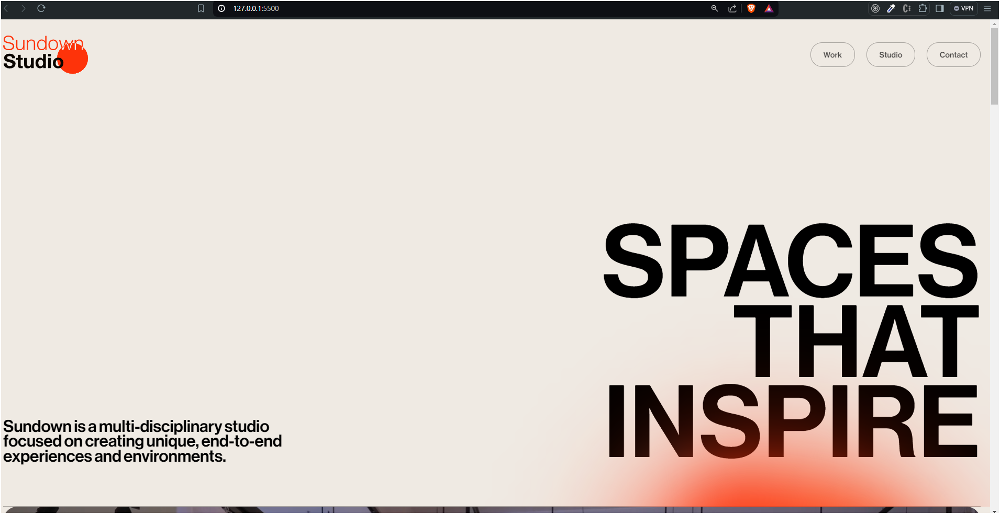

# Sundown Studio

## Here is a [LIVE LINK](https://sundown-studio-3wfp.onrender.com).


## Description
A simple clone of the Sundown Studio landing page using HTML, CSS, JavaScript, GSAP, and Locomotive Scroll. This project demonstrates modern web design techniques and smooth animations.

## Preview



## Installation

Clone the repo:
   ```bash
   git clone https://github.com/chetannn-github/sundown-studio-clone.git
   ```
## Usage
Simply open the index.html file in your browser to view and interact with the Sundown Studio.

## Features
- Responsive design
- Smooth scrolling animations with Locomotive Scroll
- Interactive animations with GSAP
  
## Technologies
- HTML
- CSS
- JavaScript
- GSAP (GreenSock Animation Platform)
- Locomotive Scroll

